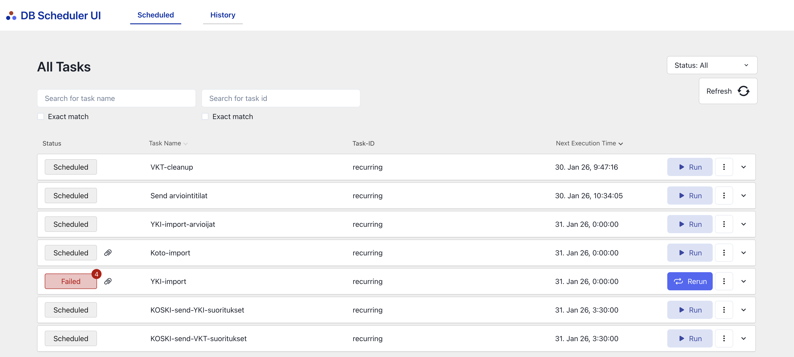

# Eräajot

Kielitutkintorekisteri käyttää [DB Scheduler](https://github.com/kagkarlsson/db-scheduler)-teknologiaa eräajojen ajastamiseen ja ajamiseen.

Eräajot määritellään koodilla ja niiden aikataulutus tulee tavallisesti properties-tiedostoista.

Eräajot voi käynnistää myös manuaalisesti ja niiden ajohistoriaa tarkastella käyttöliittymästä, joka löytyy seuraavista osoitteista:

- Untuva: [https://virkailija.untuvaopintopolku.fi/kielitutkinnot/db-scheduler]()
- QA: [https://virkailija.testiopintopolku.fi/kielitutkinnot/db-scheduler]()
- Tuotanto: [https://virkailija.opintopolku.fi/kielitutkinnot/db-scheduler]()
- Lokaali: [http://localhost:8080/kielitutkinnot/db-scheduler]()

## Yleinen kielitutkinto

### KOSKI-send-YKI-suoritukset

Lähettää KOSKI-järjestelmään ne yleisen kielitutkinnon suoritukset, joita ei ole aiemmin siirretty onnistuneesti.

### Send arviointitilat

Lähettää ilmoittautumisjärjestelmään (KIOS) sellaiset yleisen kielitutkinnon arviointitilat, joita ei aiemmin ole
saatu siirrettyä (esim. verkko- tai palvelinvian takia). Tavallisesti arviointitila lähetetään jo siinä yhteydessä
kun Solki-järjestelmästä saadaan uutta dataa. Tämän ajon tarkoitus on varmistaa tiedon perille pääsy.

### YKI-import

**Poistumassa käytöstä.** Hakee yleisen kielitutkinnon suoritukset Solki-järjestelmästä ja tallentaa ne Kielitutkintorekisteriin.

### YKI-import-arvioijat

**Poistuu käytöstä.** Hakee yleisen kielitutkinnon arvioijat Solki-järjestelmästä ja tallentaa ne Kielitutkintorekisteriin.

## Valtionhallinnon kielitutkinnot

### KOSKI-send-VKT-suoritukset

Lähettää KOSKI-järjestelmään ne valtionhallinnon kielitutkinnon suoritukset, joita ei ole aiemmin siirretty onnistuneesti.

### VKT Cleanup

Poistaa erinomaisen taitotason vkt-suorituksien osakokeet, jotka on merkitty poistettavaksi ja joiden retentioaika on täyttynyt.
Poistoaika vaihtelee ympäristöittäin.

## Kotoutumiskoulutus

### Koto-import

Hakee koto-koulutukset ja tallentaa ne Kielitutkintorekisteriin.
